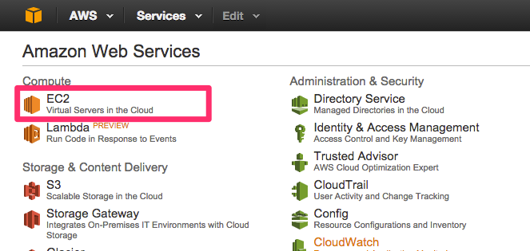
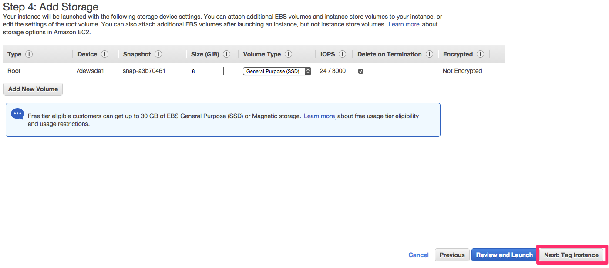
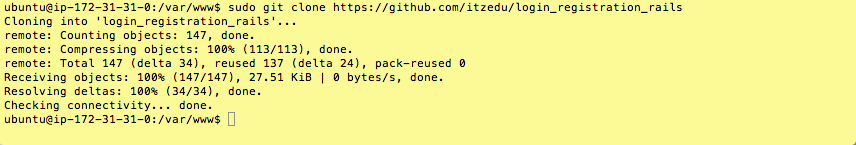
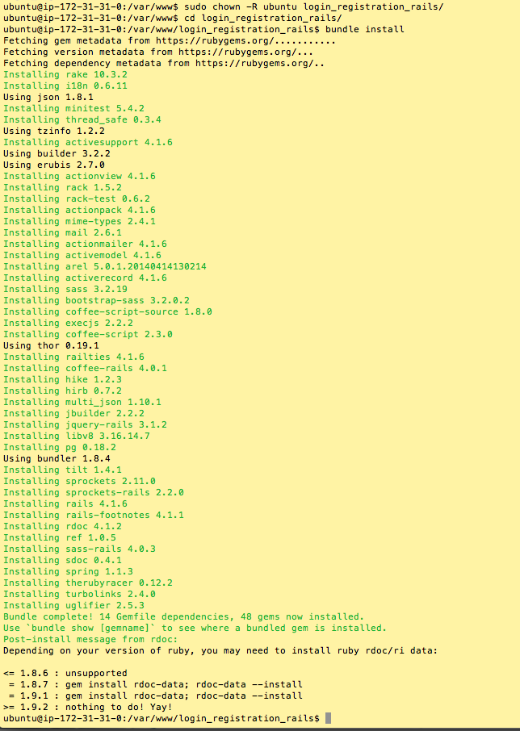
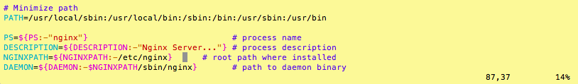
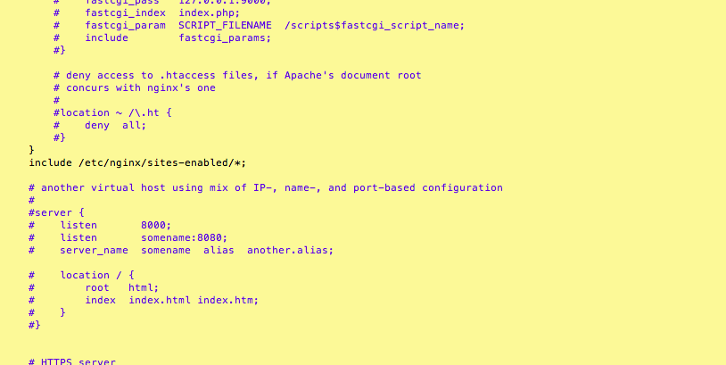
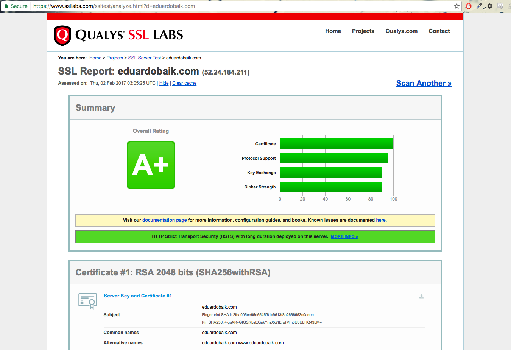

# Deploying your Rails Application to Amazon EC2
### Prerequisites:
* Basic Ruby/Rails knowledge
* Basic Terminal knowledge
* Basic Git knowledge
* AWS Free Tier account. You can sign up at: http://aws.amazon.com/free/

### Overview:
To successfully deploy our rails application, we will need to install the following into our cloud server:
* Ruby, RubyGems, Rails
* Git: We will use Git and Github to clone our project
* Nginx: Nginx is a very popular and reliable web server; however it cannot serve Ruby web applications out of the box. To solve this * issue, we must integrate Phusion Passenger. Passenger will allow our Rails application to speak HTTP.
* Phusion Passenger: Passenger will be our application server that will interact with Nginx and Ruby application.

#### Our Database:
* PostgreSQL or
* SQLite3
For more information about Passenger:

https://www.phusionpassenger.com/library/walkthroughs/basics/ruby/fundamental_concepts.html

# Setting Up Cloud Server and Connecting
1. Once you AWS account is created, let's login to the console at aws.amazon.com/console. Choose EC2 under the **Compute Category**.



2. In the EC2 dashboard, let's click the large blue button that says **Launch Instance**.


3. Now we need to choose an Amazon Machine Image(AMI). The machine that we will be using is **Ubuntu Server 14.04**. This machine should be offered by Amazon for free.

##### **IMPORTANT:** Do not select Ubuntu Server 16.04! Ubuntu 14.04 may be located towards the bottom.


4. Now we get to choose how powerful we want this computer to be. Let's go with the t2.micro which is the only free tier eligible instance. Click on **Next: Configure Instance Details** so that we can make more configurations. We will be using mostly default configurations but is good to know what you are able to customize


5. We won't be changing any of the default configurations for our instance details. Click **Next: Add Storage**.


6. This is where we want to specify how much storage we want. We will only need 8 GB for now. Click on **Next: Tag Instance**.




7. We can give our instance a name by `tagging` it. We don't need to worry about tagging an instance for now. Click on **Next: Configure Security Group**.


8. Now in the Configure Security Group page, you have the option to create a new security group. Under this Security Group, the default allowed traffic is SSH with a protocol of TCP, this means that we can only access this instance via SSH (PUTTY for windows users) or the Terminal for macs. We want to allow HTTP as well.


9. Amazon will warn us that our EC2 instance might not be very secure. However, for our first instance, our EC2 is secure enough. Go Ahead and click **launch**.

10. One last step, we need to create and download a new key pair. This is a virtual KEY that will allow us to connect to our server.

* Create new Key-Pair when launching and download it. Move the key-pair into your local machine root folder (whichever folder we move the key-pair into is the folder that we need to be in to connect with our EC2 instance)


* Now in your terminal, change the file permission by running `chmod 400 key.pem`.
* Now we will connect into our cloud server using ssh. In the terminal, run `ssh -i key.pem ubuntu@public.ip.address`.
* It will ask if you are sure to continue connecting: `yes`


Now we should be connected to our cloud server. The user in the terminal that should be: `ubuntu@your-private-ip-address`. Once connected, we need to update Ubuntu. For this, we will use Ubuntu's Advanced Packaging Tool (APT)

* In your terminal, run `sudo apt-get update` and `sudo apt-get -y upgrade`.

# Installing Ruby, Rails and Phusion Passenger
Since we are deploying a Ruby on Rails application we also need to install RVM (Ruby Version Manager). RVM will help us manage and install Ruby

* Install RVM
* First we need to download the gpg signatures:
* In your terminal, run `gpg --keyserver hkp://keys.gnupg.net --recv-keys 409B6B1796C275462A1703113804BB82D39DC0E3`
* Next we will actually run the command to install RVM.
* In your terminal, run `\curl -sSL https://get.rvm.io | bash -s stable`
* Next we will load RVM.
* In your terminal, run `source ~/.rvm/scripts/rvm`.
* Next we will check the requirements for ubuntu and install any packages missing.
* In your terminal, run `rvm requirements`.
* Next we will update our system with the required dependencies for ruby. There are a lot of them so this command will be long. **This is optional if rvm requirements successfully installed all the dependencies**.
* In your terminal, run `rvmsudo /usr/bin/apt-get install build-essential openssl libreadline6 libreadline6-dev curl git-core zlib1g zlib1g-dev libssl-dev libyaml-dev libsqlite3-dev sqlite3 libxml2-dev libxslt-dev autoconf libc6-dev ncurses-dev automake libtool bison subversion`.
* Press Y to continue.

Great Job! You have successfully installed RVM. Now RVM will help us install Ruby and RubyGems. Also, we will install Rails

* First, we will run a couple of commands to install Ruby in our system
#### Ruby
* In your terminal, run `rvm install 2.3.1` - This will install Ruby (you may replace the number with the latest version of Ruby).
* In your terminal, run `rvm use 2.3.1 --default`. This will set the default ruby version to the specified version
* Run `ruby -v` and it should give us the version that we have installed, so we know that it was successfully installed
* Next, install Ruby Gems
* In your terminal, run `rvm rubygems current`. If it asks you to update the a more current version, you can run `rvm rubygems current --force`
* Installing Rails
* In your terminal run. `gem install rails -v 4.2.7 --no-ri --no-rdoc` By specifying that we don't want to install ri or rdoc documentation, we will accelerate the installation of Rails in our system

Awesome. Now that we have Ruby and Rails installed. Our next step is to install Phusion Passenger

* Phusion Passenger is an application which can directly integrate into Nginx (the web server that we will be using for our application). Passenger will help us prepare to launch our Ruby on Rails application instances
* Now let's run, `gem install passenger`.

# Phusion Passenger
Great! Now we have Ruby and Rails in our system, along with the passenger gem. Next, let's install our web server: Nginx

* In our terminal, let's run `rvmsudo passenger-install-nginx-module`. This will bring up some options in our terminal.


* Press Enter and it will ask what language we are interested in. We will select (use space bar) Ruby and Node.js. And press enter. This will check if we have all the required software to install Nginx for our languages.


* If Passenger is not able to install curl, it will tell us the command that we need to do so. Let's follow its instructions and run `sudo apt-get install libcurl4-openssl-dev`. After the curl is installed, run `rvmsudo passenger-install-nginx-module` again
* After this, we should get a message telling us that we do not have a lot of virtual memory. We can follow passenger's recommendations. What we need to do is create a swap space for more virtual memory. More specifically, we will create a file with 1M of memory that will turn into a swap space.


* So we will abort this installer and create more virtual memory. Let us run the following commands.
* Ctrl-C to exit installation
* To create the virtual memory file we run `sudo dd if=/dev/zero of=/swap bs=1M count=1024`
* Now, let's turn the file into actual space by running `sudo mkswap /swap`
* Lastly, let's turn the swap space on, run `sudo swapon /swap`
* If you encounter a permissions error: `insecure permissions 0644, 0600 suggested` then:
* Change permissions: `sudo chmod 0600 /swap`
* Turn off swap: `sudo swapoff /swap`
* Turn it back on: `sudo swapon /swap`


* Now let's run `rvmsudo passenger-install-nginx-module` and follow Passenger's direction like we did before. We should not have any more issues during our installation.
* Passenger will ask us if we want it to download, compile and install Nginx for us. In this step, we will enter our choice as `1`.


* Then, it will ask us where we would like to install Nginx. The prefix directory will be `/etc/nginx`.


* Congratulations! We have installed Nginx!


# PostgreSQL (if you wish to use SQLite3, skip to the next step)
We will be deploying the Rails version of the WALL assignment. Note, that this application will use PostgreSql as the database. If your application uses SQlite or another database such as MySql, you will need to install the appropriate dependencies or switch the database to PostgreSQL.

So let's install PostgresSQL and its development libraries:

* In your terminal, run `sudo apt-get install postgresql postgresql-contrib libpq-dev`. Press Y when the terminal asks for more space.

Now we will set up a PostgreSQL superuser user.

* In your terminal, let's run `sudo su postgres -c psql`. This should bring up the Postgres prompt.

* Now let's create the user. This username should be the same username that you have in Rails application. You can check the username at: `your_rails_project/config/database.yml`.
* In the terminal, let's run `CREATE ROLE ubuntu SUPERUSER LOGIN;` (DO NOT FORGET THE SEMICOLON AFTER YOUR STATEMENT).
This is how your terminal should look like:


* And this is our database.yml file in our rails project. Notice the **USERNAME: UBUNTU** in the default block


# Installing NodeJS, Git and Downloading Rails Application
Very nice! Before we configure our Nginx server we will import our Rails Project using Git and GitHub. As you might have guessed, we need to install Git. We are also going to install NodeJS, so that we avoid getting a javascript runtime error from the Asset Pipeline

* Let's run, `sudo apt-get install nodejs`.
* Let's run, `sudo apt-get install git`.
* In our terminal, let's navigate to `cd /var` and create a directory named www by running the command `sudo mkdir www`. Then, we will navigate into the directory we just created by running `cd www`. This directory is where we are going to have our application.


* Now we will clone the application from the GitHub repository. Reminder: If you are using PostgreSQL, make sure that your database.yml file is set up as above when we installed PostgreSQL.

* In your terminal, run `sudo git clone https://github.com/<your_user_name>/<your_rails_project>`.



* Next, let's change the ownership of our rails project to our ubuntu user.
* In the terminal, run `sudo chown -R ubuntu your_rails_project`. Let's navigate into our project and run `bundle install`



* Now let's create a log file to record development.

* In the terminal let's run `sudo touch log/development.log`. Also, let's change the permission of the log file. Run `sudo chmod 0666 /var/www/<your_rails_project>/log/development.log`


* Next, let's create the databases and run our migrations.
* Only if you are using PostgreSQL, run `rake db:create:all`.
* Run `rake db:migrate`. No matter what kind of database.

If you are using PostgreSQL, we can run `rails db` to see our development database in the terminal. Next run `\d` for the list of tables. If you are using SQLite3, you can just go to the rails console.


# Starting and Configuring Nginx
Congratulations! We are almost there. Now we will download a Nginx start up script and make it executable.

* To get the Nginx start up script, run `sudo wget https://raw.github.com/JasonGiedymin/nginx-init-ubuntu/master/nginx -O /etc/init.d/nginx`


* Now let's make it executable. run `sudo chmod +x /etc/init.d/nginx`
* Next, let's navigate to Nginx file by running `cd /etc/init.d` and then `sudo vi nginx`
* To insert in vim press `i` key
* Change line 21 to `/etc/nginx/conf/nginx.conf`
* Change line 22 to `/etc/nginx/logs/nginx.pid`


* Change line 87 to `NGINXPATH=${NGINXPATH:-/etc/nginx}`



* Now, let's save the file. Press ESC, and then :wq
* Let's see if it works now. Run `sudo service nginx start`. We should get [ OK ]

Now, we need to configure our Nginx server.

* Let's navigate to `cd /etc/nginx`
* Let's make two directories. One for sites available and another one for sites enabled.
* Run`sudo mkdir sites-available` and `sudo mkdir sites-enabled`
* Navigate to the conf directory. Run `cd conf`
* Let's make some changes in the file. Run `sudo vi nginx.conf`
* Below the server section type `include /etc/nginx/sites-enabled/*;`. Then escape and :wq out of the file.



* Now, let's navigate to `/etc/nginx/sites-available` and create rails.conf file
* Run `cd /etc/nginx/sites-available`
* Then, `sudo touch rails.conf`
* Now we will write in our file, `sudo vi rails.conf`. This will be our code:
```
server {
      listen 80;
      server_name <public_ip_address>;
      passenger_enabled on;
      passenger_app_env development;
      root /var/www/<your_project_folder>/public;
      }
```

* Dont forget to write and quit - :wq


* Now, let's create a symbolic link between the directories `sites-enabled` and `sites-available`
* Run, `sudo ln -s /etc/nginx/sites-available/rails.conf /etc/nginx/sites-enabled/rails.conf`
* Restart Nginx by running `sudo service nginx restart`. We should get two [ OK ]'s


# HTTPS (Secure Socket Layer) - OPTIONAL
HTTPS stands for Hyper Text Transfer Protocol Secure. When we have a HTTPS connection, all communications between the browser and the server are encrypted. This allows the user to feel more secure when using your website, especially if they need to input some personal information or credit card transactions. In today's web, it is almost standard to have an HTTPS connection. Even browsers will the user about an insecure connection. For example:


We will configure our NGINX webserver to have an HTTPS connection. However, you must have the following prerequesites:

* You must have deployed your application on AWS (Amazon Web Services) using a Ubuntu 14.04 EC2 instance.
* You must own a registered domain name. In this example we will be using a domain name from GoDaddy.
* Set up your domain name such that the A record points to your public ip address of your EC2 instance.

### Let's Encrypt
The very first thing we must do is obtain an SSL certificate. Companies such as Verisign sell these certificates that can cost up to $1000 dollars! When you buy a certificate from Verisign, you will also get a small logo that you can put up on your website to let your users know that your secure connection is from a reliable source.


Wouldn't it be nice if big companies sponsored a certificate provider that allows users to have secure connections for FREE!? Enter [Let's Encrypt](https://letsencrypt.org/).

Let's Encrypt is sponsored by companies such as Facebook, Mozilla and Chrome. Anyone can download their certificates and your server will have a secure connection as long as you renew it every 90 days.

### Installing cert-bot
Let's encrypt uses the `certbot-auto` software to obtain, install and renew certificates. We are going to download it in our `/usr/local/sbin` folder and make the script executable:

```bash
$ cd /usr/local/sbin
$ sudo wget https://dl.eff.org/certbot-auto
$ sudo chmod a+x /usr/local/sbin/certbot-autoCopy
```

### Downloading a Certificate
We will add a .well-know directory in our project that cert-bot will use to to request the certificate.

```bash
$ cd /etc/nginx/sites-available
$ sudo vi rails.confCopy
```
Add the `location` block, the write and quit.


If there are no errors, our web server should be able to restart. Also as a reminder, make sure that your A record of your domain name points to the public ip address of your EC2 instance.

```bash
$ sudo service nginx restartCopy
```

Next, we will actually download the certificates. You will need to change 3 things from the following command:

```bash
$ certbot-auto certonly -a webroot --webroot-path=/var/www/demo_app/public -d eduardobaik.com -d www.eduardobaik.comCopy
```
* --webroot-path=/var/www/<\your_project_folder>\public
* -d <your_domain_name>.com
* -d www..com

In this example, we have the webroot-path to be /var/www/demo_app/public, and the domain names to be `eduardobaik.com` and `www.eduardobaik.com`.

certbot-auto will ask you for an emergency email and a confirmation for their Terms of Agreement. After that, you should be able see a similar screen to this:


We will also add a Diffie-Hellman group to secure our connections even more. This could take a few of minutes.
```
$ sudo openssl dhparam -out /etc/ssl/certs/dhparam.pem 2048```
```

### Configuring Nginx
Lastly, we will have to configure our webserver to use our certificates. We will have to create two server blocks.
```bash
$ cd /etc/nginx/sites-available
$ sudo vi rails.conf
```

The first server block will redirect all HTTP traffic to HTTPS.
```bash
server {
  listen 80;
  server_name <your_domain_name>.com www.<your_domain_name>.com;
  location ~/.well-known {
    allow all;
  }
  return 301 https://$host$request_uri;
}
```
The second server block will be our secure connection configuration. Also, we will have to move our passenger configuration to this block. Note that you will have to add your domain name to the lines that start with *server_name, ssl_certificate, and ssl_certificate_key*. Also, make sure that your document root is pointed to your project in /var/www/public.
```bash
server {
    listen 443 ssl;
    server_name <your_domain_name>.com www.<your_domain_name>.com;
    passenger_enabled on;
    passenger_app_env development;
    ssl_certificate /etc/letsencrypt/live/eduardobaik.com/fullchain.pem;
    ssl_certificate_key /etc/letsencrypt/live/eduardobaik.com/privkey.pem;
    ssl_protocols TLSv1 TLSv1.1 TLSv1.2;
    ssl_prefer_server_ciphers on;
    ssl_dhparam /etc/ssl/certs/dhparam.pem;
    ssl_ciphers 'ECDHE-RSA-AES128-GCM-SHA256:ECDHE-ECDSA-AES128-GCM-SHA256:ECDHE-RSA-AES256-GCM-SHA384:ECDHE-ECDSA-AES256-GCM-SHA384:DHE-RSA-AES128-GCM-SHA256:DHE-DSS-AES128-GCM-SHA256:kEDH+AESGCM:ECDHE-RSA-AES128-SHA256:ECDHE-ECDSA-AES128-SHA256:ECDHE-RSA-AES128-SHA:ECDHE-ECDSA-AES128-SHA:ECDHE-RSA-AES256-SHA384:ECDHE-ECDSA-AES256-SHA384:ECDHE-RSA-AES256-SHA:ECDHE-ECDSA-AES256-SHA:DHE-RSA-AES128-SHA256:DHE-RSA-AES128-SHA:DHE-DSS-AES128-SHA256:DHE-RSA-AES256-SHA256:DHE-DSS-AES256-SHA:DHE-RSA-AES256-SHA:AES128-GCM-SHA256:AES256-GCM-SHA384:AES128-SHA256:AES256-SHA256:AES128-SHA:AES256-SHA:AES:CAMELLIA:DES-CBC3-SHA:!aNULL:!eNULL:!EXPORT:!DES:!RC4:!MD5:!PSK:!aECDH:!EDH-DSS-DES-CBC3-SHA:!EDH-RSA-DES-CBC3-SHA:!KRB5-DES-CBC3-SHA';
    ssl_session_timeout 1d;
    ssl_session_cache shared:SSL:50m;
    ssl_stapling on;
    ssl_stapling_verify on;
    add_header Strict-Transport-Security max-age=15768000;
    root /var/www/<your_app>/public;
}
```
This is our rails.conf looks like.


Finally, restart the nginx server one more time and we will be able to visit our domain name with a secure connection!

```bash
$ sudo service nginx restartCopy
```


Visit this website to check the security level of our connection: https://www.ssllabs.com/ssltest/



### Auto Renew
* Since Let's Encrypt certificates are only valid for 90 days, we will have to update our certificate regularly. We can manually log into our server and run `certbot-auto renew` every two months. But a better solution would be to create a cron job for that.

* Open the crontab by running `$ sudo crontab -e`. Choose your editor and add the following lines:

```bash
> 15 1 * * 1 /usr/local/sbin/certbot-auto renew >> /var/log/le-renew.log
> 20 1 * * 1 /etc/init.d/nginx reloadCopy
```

These cron jobs will run every Monday at 1:15 AM and at 1:20 AM. The first job will check the expiration date of our certificate and renew it if close to be expired. The second job will reload nginx.

# Fin
Congratulations on having a secure website! With a little configuration, you can add various domain names and also add SSL to all your websites and not just Ruby on Rails powered applications. Your users will definitely appreciate using more secure servers!
